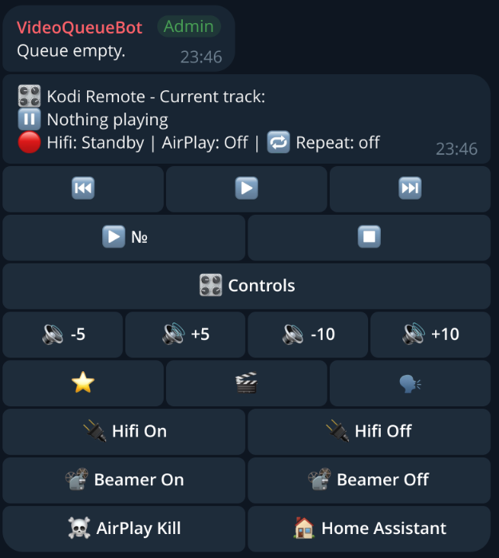
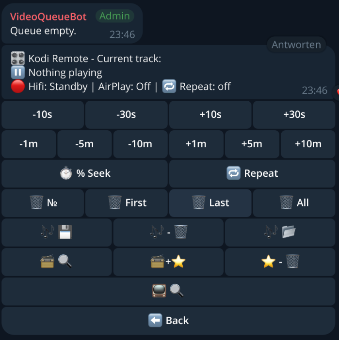
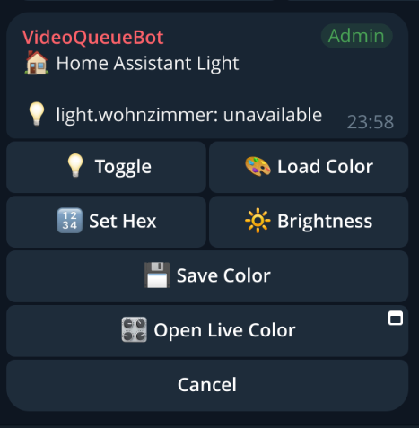
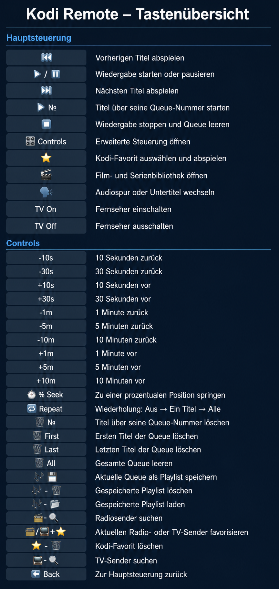

# Kodi Media Bot for Telegram

<p align="center">
  
</p>

This bot controls Kodi and a CEC device (HiFi/TV) via Telegram.

Besides YouTube and SoundCloud queue links, the bot can also play Telegram
voice/video uploads and selected social-media video URLs directly once.
Those temporary media files are deleted again after playback stops.

## Features

- Telegram queue with persistent panel message IDs, so the existing panel is
  edited in place across container restarts and redeployments.
- YouTube and SoundCloud queues with play/pause, next/previous, repeat, seeking,
  queue editing and saved playlists.
- Kodi favourites, movie/series browsing, audio-track and subtitle selection.
- Radio Browser search, IPTV channel search and radio/TV favourites.
- Configurable TV or projector power commands, optional CEC/Denon controls and
  optional Home Assistant light control.
- Telegram uploads and selected social-media links with automatic temporary-file
  cleanup.
- Optional local Telegram Bot API for files larger than the cloud API's 20 MB
  download limit.

## Screenshots

<p align="center">
  
  
  
</p>

### Button reference

<p align="center">
  
</p>

The same image is available inside Telegram: `🎛 Controls` → `❓ Buttons` posts it
below the panel, and the `🙈 Ausblenden` button underneath removes it again. The
image is uploaded once and reused from its Telegram `file_id` afterwards, so it
has to be present at `assets/panel_button_reference.png` in the image.

## Telegram panel and commands

The bot keeps two messages in `STARTUP_CHAT_ID`: the queue list and the control
panel. Their message IDs are written to `UI_STATE_FILE`. Keep that file on a
persistent volume so a restart or redeployment edits the existing messages
instead of creating another panel.

- `/start` refreshes the regular bot view.
- `/resetpanel` deletes and recreates the queue list and control panel. It also
  stops playback and clears the queue; it is not only a visual refresh.

The optional `PANEL_SHOW_*` flags remove their matching button rows. Hifi,
AirPlay and volume status text is hidden by the same flags. When those status
fields are hidden, a neutral divider keeps the inline keyboard at a stable width.

To discover a group ID, temporarily stop the bot so it does not consume updates,
send any message in the group and query the local Bot API. Read
`result[].message.chat.id` from the response:

```bash
TG_TOKEN=$(sed -n 's/^TG_TOKEN=//p' /storage/.env | head -n1)
curl -s "http://127.0.0.1:8081/bot${TG_TOKEN}/getUpdates"
```

## Structure
- `main.py`: Entrypoint.
- `kodibot/config.py`: Central configuration.
- `kodibot/core/`: Kodi JSON-RPC, queue state, and playlist storage.
- `kodibot/telegram/`: Telegram handlers, UI panel rendering, and integrated media server.
- `tests/`: Pytest unit tests.
- `Dockerfile`: Builds the image.

## Build
From this folder:
```
docker build -t partyqueue .
```

## Kodi and addons (LibreELEC)

Enable Kodi's web server under `Settings -> Services -> Control`. `KODI_USER`,
`KODI_PASS` and `KODI_PORT` must exactly match that configuration; otherwise the
bot can show a queued title but cannot start playback or display its runtime.

The SoundCloud and YouTube addons are required for their respective links. The
YouTube addon also needs its own API key, client ID and client secret configured
inside Kodi. Those YouTube credentials are not read from the bot's `.env`.

To get the SoundCloud client ID and place it in `.env` as `SC_CLIENT_ID`:
```
cat /storage/.kodi/userdata/addon_data/plugin.audio.soundcloud/cache/api-client-id
```

`pvr.iptvsimple` is only required if the playlist should also appear in Kodi's
native TV/PVR interface. The bot's own TV search reads `IPTV_M3U_URL` directly.

## LibreELEC deployment

The deployment uses the following persistent files on LibreELEC. The SSH keys
are only required when CEC or display commands are forwarded to the host:

```text
/storage/.env
/storage/docker-compose.yml
/storage/bin/docker-compose
/storage/docker/partyqueue/id_ed25519
/storage/docker/partyqueue/id_ed25519.pub
```

Docker must be installed and active, and `/storage/bin/docker-compose` must be an
executable Compose v2 binary. The deploy script creates
`/storage/docker/partyqueue/vOpus` and the persistent `data` directory itself.
It deliberately does not copy or replace `.env`, `docker-compose.yml` or SSH
keys.

Set `REMOTE_HOST` near the top of `deploy_libreelec_partyqueue.sh`, then run:

```bash
./deploy_libreelec_partyqueue.sh
```

The script replaces only the deployed source directory, copies `data/kodi.m3u`,
rebuilds the image and runs the complete `/storage/docker-compose.yml`. If that
Compose file contains unrelated services, Compose may recreate those services as
well. Keep playlists, uploads, colors and `UI_STATE_FILE` outside the replaced
source directory through the mounted `/storage/docker/partyqueue` paths.

## SSH key setup (for CEC commands)
CEC buttons use SSH to run `cec-ctl` on the host. You need a key in the container:

1) Create a key on the host:
```
ssh-keygen -t ed25519 -f /storage/docker/partyqueue/id_ed25519
```

2) Allow the key on the host:
```
cat /storage/docker/partyqueue/id_ed25519.pub >> /storage/.ssh/authorized_keys
```

3) Fix permissions (important):
```
chmod 700 /storage/docker/partyqueue
chmod 600 /storage/docker/partyqueue/id_ed25519
chmod 644 /storage/docker/partyqueue/id_ed25519.pub
```

## Docker Compose
```yaml
services:
  telegram-bot-api:
    image: aiogram/telegram-bot-api:latest
    container_name: telegram-bot-api
    restart: unless-stopped
    network_mode: host
    environment:
      TELEGRAM_API_ID: "YOUR_API_ID"
      TELEGRAM_API_HASH: "YOUR_API_HASH"
      TELEGRAM_LOCAL: "1"
      TELEGRAM_HTTP_PORT: "8081"
    volumes:
      - telegram-bot-api-data:/var/lib/telegram-bot-api

  kodi-media-bot:
    build: .
    container_name: kodi-media-bot
    restart: unless-stopped
    network_mode: host
    privileged: true
    depends_on:
      - telegram-bot-api
    environment:
      TG_TOKEN: "YOUR_TELEGRAM_BOT_TOKEN"
      STARTUP_CHAT_ID: "YOUR_TELEGRAM_CHAT_ID"
      KODI_HOST: "172.17.0.1"
      KODI_PORT: "8080"
      KODI_WS_PORT: "9090"
      KODI_USER: "USER"
      KODI_PASS: "Password"
      PROJECTOR_LIRC_DEVICE: "/dev/lirc0"
      PROJECTOR_ADDRESS: "0x08"
      PROJECTOR_POWER_ON_CODE: "0x03"
      PROJECTOR_POWER_OFF_CODE: "0x00"
      PROJECTOR_POWER_ON_REPEATS: "4"
      DISPLAY_BUTTON_LABEL: "📽 Beamer"
      DISPLAY_POWER_ON_CMD: "python -m kodibot.core.projector on"
      DISPLAY_POWER_OFF_CMD: "python -m kodibot.core.projector off"
      DISPLAY_COMMAND_TIMEOUT: "15"
      PANEL_SHOW_VOLUME: "true"
      PANEL_SHOW_HIFI: "true"
      PANEL_SHOW_DISPLAY: "true"
      PANEL_SHOW_AIRPLAY: "true"
      PANEL_SHOW_HA: "true"
      CEC_HOST: "172.17.0.1"
      DENON_HOST: ""
      DEBUG_WS: "1"
      SC_CLIENT_ID: "YOUR_CLIENT_ID"
      MEDIA_BASE_URL: "http://YOUR_HOST_IP:8765"
      UI_STATE_FILE: "/data/playlists/telegram_ui_state.json"
      TELEGRAM_LOCAL_MODE: "1"
      TELEGRAM_BASE_URL: "http://127.0.0.1:8081/bot"
      TELEGRAM_BASE_FILE_URL: "http://127.0.0.1:8081/file/bot"
      HA_HOST: "HA_IP"
      HA_PORT: "8123"
      HA_TOKEN: "YOUR_HA_TOKEN"
      HA_LIGHT_ID: "light.living_room"
      HA_WEBAPP_URL: "https://bot.example.com/app/ha-color"
      HA_COLORS_FILE: "/data/colors/ha_colors.json"
      IPTV_M3U_URL: "https://raw.githubusercontent.com/jnk22/kodinerds-iptv/master/iptv/clean/kodi_tv.m3u,https://iptv-org.github.io/iptv/countries/de.m3u"
      RADIO_API_URL: "https://de1.api.radio-browser.info/json"
    volumes:
      - /storage/docker/partyqueue:/root/.ssh:ro
      - /storage/docker/partyqueue/playlists:/data/playlists
      - /storage/docker/partyqueue/uploads:/data/uploads
      - /storage/docker/partyqueue/colors:/data/colors
      - telegram-bot-api-data:/var/lib/telegram-bot-api:ro

  caddy-webapp:
    image: caddy:2-alpine
    container_name: kodi-media-bot-caddy
    restart: unless-stopped
    network_mode: host
    depends_on:
      - kodi-media-bot
    environment:
      WEBAPP_HOSTNAME: "bot.example.com"
      ACME_EMAIL: "you@example.com"
    volumes:
      - ./Caddyfile:/etc/caddy/Caddyfile:ro
      - caddy-data:/data
      - caddy-config:/config

volumes:
  telegram-bot-api-data:
  caddy-data:
  caddy-config:
```

*(Note: To use the local Bot API server for uploads > 20 MB, you need your Telegram `api_id` and `api_hash` from `https://my.telegram.org`.)*

**Start the stack:**
```bash
cp .env.local-bot-api.example .env
# edit .env
docker compose -f docker-compose.local-bot-api.yml up -d --build
```

### Explanations
- **`telegram-bot-api`**: Used for large Telegram uploads. It stores files under `/var/lib/telegram-bot-api`. This volume is mounted into `kodi-media-bot` as read-only.
- **`kodi-media-bot`**: The main bot container.
- **`caddy-webapp`**: Public HTTPS reverse proxy required for the Telegram Mini App (Home Assistant color picker).

Bot data is persisted on the host in `/storage/docker/partyqueue/` (playlists, uploads, HA colors, SSH keys).

Important when switching an existing bot from the Telegram cloud Bot API to a local Bot API server:
```bash
curl -s "https://api.telegram.org/bot${TG_TOKEN}/logOut"
```

Without this one-time `logOut`, Telegram may keep the bot attached to the cloud Bot API and the local server will not behave correctly.

### HTTPS for the Home Assistant Mini App
Telegram Mini Apps require a public `https://` URL with a valid certificate. The local compose setup now includes a `caddy-webapp` reverse proxy for that purpose.

Requirements:
- A public DNS name such as `bot.example.com` pointing to your Docker host.
- Incoming ports `80/tcp` and `443/tcp` forwarded to that host.
- `WEBAPP_HOSTNAME` set to that DNS name.
- `ACME_EMAIL` set to a real email address for Let's Encrypt.
- `HA_WEBAPP_URL` set to `https://YOUR_HOST/app/ha-color`.
- In `@BotFather`, configure the bot's Main Mini App to the same URL so the group-chat `Open Live Color` button can open the Mini App directly.
- `CADDYFILE_PATH` set when the compose file is started from a different host directory than the project root.

Important:
- Keep `MEDIA_BASE_URL` for Kodi uploads separate if needed. It may stay an internal HTTP URL like `http://192.168.178.10:8765`.
- `HA_WEBAPP_URL` is only for Telegram's Mini App webview and should usually be the public HTTPS hostname served by Caddy.

Example:
```env
MEDIA_BASE_URL=http://192.168.178.10:8765
WEBAPP_HOSTNAME=bot.example.com
ACME_EMAIL=you@example.com
HA_WEBAPP_URL=https://bot.example.com/app/ha-color
CADDYFILE_PATH=/storage/docker/partyqueue/vOpus/Caddyfile
```

Notes:
- `--network host` is required so the bot can reach Kodi JSON-RPC on the host.
- `STARTUP_CHAT_ID` is the numeric target chat ID. Telegram supergroup IDs are
  negative and usually start with `-100`.
- `KODI_HOST` is used for Kodi JSON-RPC.
- `DENON_HOST` is used for AirPlay status detection (`/goform/formNetAudio_StatusXml.xml`), main-zone volume readout (`/goform/formMainZone_MainZoneXml.xml`), Denon power control (`/goform/formiPhoneAppPower.xml`), and volume up/down via HTTP direct commands (`/goform/formiPhoneAppDirect.xml?MVUP` / `MVDOWN`) on the Denon receiver.
- Leave `DENON_HOST` empty when no Denon receiver is used. Do not set it to
  `false`, because any non-empty value is interpreted as a hostname.
- Denon requirement: on the receiver, set `Setup -> Netzwerk -> Netzwerk-Steuerung -> Immer ein`, otherwise LAN control/status may fail in standby.
- `CEC_HOST` is used for CEC over SSH. If not set, it falls back to `KODI_HOST`.
- If `DENON_HOST` is set, volume buttons use Denon HTTP direct control; otherwise volume buttons use CEC over SSH via `CEC_HOST`.
- `KODI_USER`/`KODI_PASS` configure Kodi JSON-RPC auth and are required.
- `KODI_WS_PORT` configures the Kodi websocket port.
- `DEBUG_WS=1` enables websocket debug logging.
- `SC_CLIENT_ID` configures the SoundCloud client id.
- `UPLOAD_DIR` sets the local upload directory (default `/data/uploads`).
- `MEDIA_SERVER_HOST` configures the bind address of the built-in upload server (default `0.0.0.0`).
- `MEDIA_SERVER_PORT` configures the port of the built-in upload server (default `8765`).
- `MEDIA_BASE_URL` should point to the bot host from Kodi's point of view, for example `http://192.168.1.20:8765`.
- `MEDIA_SERVER_PUBLIC_HOST` is an optional fallback when `MEDIA_BASE_URL` is not set.
- `UI_STATE_FILE` stores the Telegram list/panel message IDs so redeploys and
  restarts can edit the existing panel instead of posting a duplicate. The
  local compose setup uses `/data/playlists/telegram_ui_state.json`, which is
  persisted by the playlists volume.
- `PANEL_SHOW_VOLUME`, `PANEL_SHOW_HIFI`, `PANEL_SHOW_DISPLAY`,
  `PANEL_SHOW_AIRPLAY` and `PANEL_SHOW_HA` accept `true` or `false`. They hide
  only their corresponding panel sections; disabled Hifi, AirPlay and volume
  sections are also omitted from the status line.
- `TELEGRAM_LOCAL_MODE=1` enables support for a local `telegram-bot-api` server, which is required if the bot should download Telegram uploads larger than 20 MB.
- `TELEGRAM_BASE_URL` optionally overrides the Telegram API endpoint, for example `http://127.0.0.1:8081/bot`.
- `TELEGRAM_BASE_FILE_URL` optionally overrides the Telegram file endpoint, for example `http://127.0.0.1:8081/file/bot`.
- `TELEGRAM_DOWNLOAD_SIZE_LIMIT_MB` changes the pre-check limit for cloud Bot API downloads (default `20`). Leave this unchanged unless you know your Telegram endpoint supports more.
- `TELEGRAM_READ_TIMEOUT` and `TELEGRAM_GET_FILE_READ_TIMEOUT` default to `300` seconds in the local Bot API setup so large Telegram files have enough time to be prepared and returned.
- The image includes `ffmpeg` so Telegram MP4 uploads can be remuxed with `+faststart` before playback.
- `kodi.m3u` is copied into the image as `/data/kodi.m3u` and is used to map channel names to stream URLs for ICY now-playing title lookup.
- `RADIO_M3U_PATH` optionally overrides the M3U path (default: `/data/kodi.m3u`).
- `RADIO_API_URL` configures the community-driven Radio Browser API mirror (default: `https://de1.api.radio-browser.info/json`).
- `IPTV_M3U_URL` configures a comma-separated list of M3U stream playlists for the live TV search (default: Kodinerds clean list + iptv-org Germany list).
- `RADIO_STREAM_MAP` is optional and overrides entries from `kodi.m3u`. Example: `{"Radioactive Sifnos":"https://streamyourdream.org:8050/radioactive"}`.
- `ICY_TITLE_TTL` (seconds, default `15`) configures how long ICY titles are cached.
- `ICY_TIMEOUT` (seconds, default `6`) configures the ICY metadata fetch timeout.
- `RADIO_YT_TTL` (seconds, default `21600`) configures how long resolved YouTube links for radio tracks are cached.
- `RADIO_YT_FAIL_TTL` (seconds, default `300`) configures how long failed YouTube lookups are cached.
- `RADIO_YT_TIMEOUT` (seconds, default `8`) configures the timeout for `yt-dlp` YouTube search.
- Playlists are saved to `/data/playlists` inside the container. Mount a host path to persist them.
- Telegram uploads are stored temporarily in `/data/uploads` inside the container, deleted again after playback stops, and old leftovers are cleaned up on bot startup.
- Social-media video links from supported domains like TikTok, Instagram, Facebook and X/Twitter are downloaded once with `yt-dlp`, played directly, and then deleted again.
- Use the “Save” and “Load” buttons in the Telegram panel to store or restore the queue.
- `HA_HOST` is the IP address of your Home Assistant instance.
- `HA_PORT` is the port of Home Assistant (default `8123`).
- `HA_TOKEN` is your Long-Lived Access Token from Home Assistant.
- `HA_LIGHT_ID` is the entity ID of the light you want to control (e.g., `light.living_room`).
- `HA_WEBAPP_URL` optionally points to the Telegram Mini App for the HA light control. It must be an `https://` URL.
- `HA_COLORS_FILE` stores saved colors as JSON. In `docker-compose.local-bot-api.yml` it is set to `/data/colors/ha_colors.json`.
- `WEBAPP_HOSTNAME` is the public DNS hostname used by the bundled Caddy reverse proxy for the Mini App.
- `ACME_EMAIL` is the email address Caddy uses for Let's Encrypt certificate management.
- `CADDYFILE_PATH` optionally overrides the host path mounted as `/etc/caddy/Caddyfile`.
- If `HA_WEBAPP_URL` is not set, the bot falls back to `MEDIA_BASE_URL/app/ha-color` when `MEDIA_BASE_URL` itself is `https://`.
- If `HA_HOST` is set, a `🏠 Home Assistant` button appears in the panel with options to toggle the light, open `Live Color`, set a hex color, adjust brightness, save the current color, load saved colors, and delete saved colors.
- In private chats the HA menu shows the embedded `Live Color` Mini App button directly.
- In group chats the HA menu shows `Open Live Color`, which uses Telegram's Main Mini App deep link and therefore depends on the BotFather Mini App configuration above.

### `KODI_HOST` vs `MEDIA_BASE_URL`
- `KODI_HOST=172.17.0.1` is used by the bot to reach Kodi JSON-RPC.
- `MEDIA_BASE_URL` is used by Kodi to reach the bot's temporary upload server.
- These values can be the same host, but they have different directions.
- If Kodi can reach the bot under `http://172.17.0.1:8765`, then `MEDIA_BASE_URL=http://172.17.0.1:8765` is fine.
- If Kodi cannot reach that address, use the real LAN IP of the Docker host instead, for example `http://192.168.178.10:8765`.

## Troubleshooting
- `ssh: not found`: install `openssh-client` in the image.
- `Host key verification failed`: the bot uses SSH options to skip host key checks.
- `Permission denied`: key not mounted or permissions too open; re-check SSH setup.
- The title is visible but playback/runtime is missing: verify that
  `KODI_USER`, `KODI_PASS` and `KODI_PORT` match Kodi's web-server settings.
- Duplicate panels after a restart: verify that `UI_STATE_FILE` points into the
  persistent playlists volume and is writable by the bot.
- `sh: .env: ... not found` while sourcing `.env`: Compose accepts command
  values containing spaces, but a shell does not unless they are quoted. Avoid
  sourcing the complete Compose `.env`; read individual values when needed.
- `MEDIA DOWNLOAD FAIL ... File is too big`: this is the Telegram Bot API download limit. Normal cloud Bot API downloads stop at 20 MB. For large uploads, run a local `telegram-bot-api` server and set `TELEGRAM_LOCAL_MODE=1`, `TELEGRAM_BASE_URL`, and `TELEGRAM_BASE_FILE_URL`.

## Display power (projector or TV)

The panel carries a "Power On" and a "Power Off" button. What they do is entirely
up to configuration: they run a shell command you supply, so infrared, CEC, an
HTTP request and a local script are all handled the same way. The button caption
is configurable too, so the pair can read `📽 Beamer` or `📺 TV`.

Out of the box they drive an infrared projector (such as the WiMiUS) through a
**100% native kernel-level LIRC architecture**, which works on all Raspberry Pi
generations (including **Pi 3, 4, 5 and Zero**) running LibreELEC or Raspberry Pi
OS. The bot writes pulse timings directly to `/dev/lirc0` with hardware-precision
timing. **No external libraries, network ports, or background daemons (like
`pigpiod`) are required!**

### Infrared setup (LibreELEC)

To enable the native kernel IR transmitter on GPIO 17:

1) Remount the boot partition as read-write, add the `gpio-ir-tx` overlay to `/flash/config.txt`, and reboot the Pi:
```bash
mount -o remount,rw /flash
echo "dtoverlay=gpio-ir-tx,gpio_pin=17" >> /flash/config.txt
mount -o remount,ro /flash
reboot
```

2) Ensure the `kodi-media-bot` container is running in `privileged: true` mode in your `docker-compose.yml` so it has direct hardware access to `/dev/lirc0`:
```yaml
  kodi-media-bot:
    # ...
    privileged: true
```

3) Set the following environment variables in your `.env` file:
```env
# Projector (Beamer) Infrared Configuration
PROJECTOR_LIRC_DEVICE=/dev/lirc0
PROJECTOR_ADDRESS=0x08
PROJECTOR_POWER_ON_CODE=0x03
PROJECTOR_POWER_OFF_CODE=0x00
PROJECTOR_POWER_ON_REPEATS=4
```
*(Hex values can be provided in `0x` format and will be automatically parsed).*

The GPIO pin is **not** configured here — it belongs to the kernel overlay
`dtoverlay=gpio-ir-tx,gpio_pin=17` in `/flash/config.txt` from step 1.

### Configuring the buttons

```env
DISPLAY_BUTTON_LABEL=📽 Beamer
DISPLAY_POWER_ON_CMD=python -m kodibot.core.projector on
DISPLAY_POWER_OFF_CMD=python -m kodibot.core.projector off
DISPLAY_COMMAND_TIMEOUT=15
TV_HOST=
```

These are the defaults, and they drive the infrared transmitter described above.
A command that exits non-zero, times out, or is empty reports a failure in the
button's toast.

### Hiding panel buttons

Five button groups can be switched off individually. All default to `true`, so
leaving them unset keeps the full panel:

```env
PANEL_SHOW_VOLUME=true     # 🔉 -5 / 🔊 +5 / 🔉 -10 / 🔊 +10
PANEL_SHOW_HIFI=true       # 🔌 Hifi On / Off
PANEL_SHOW_DISPLAY=true    # the power buttons described above
PANEL_SHOW_AIRPLAY=true    # ☠️ AirPlay Kill
PANEL_SHOW_HA=true         # 🏠 Home Assistant
```

Hiding a group removes its row; the remaining rows keep their order and move up.
`PANEL_SHOW_HA` can only hide the button — Home Assistant still has to be
reachable for it to appear at all. `AirPlay Kill` is a CEC command and no longer
depends on Home Assistant being configured.

### Driving a TV instead

`TV_HOST` is available inside the command as `$TV_HOST`, because commands run
through a shell and inherit the environment.

Display commands run inside the bot container. A device such as `/dev/cec1` or
a host-only script under `/storage` therefore has to be reached through SSH,
unless it is explicitly mounted into the container. With the SSH key setup from
above, a LibreELEC-hosted power-off script can be called like this:

```env
DISPLAY_BUTTON_LABEL=TV
CEC_HOST=172.17.0.1
DISPLAY_COMMAND_TIMEOUT=90
DISPLAY_POWER_OFF_CMD=ssh -o StrictHostKeyChecking=no -o UserKnownHostsFile=/dev/null root@$CEC_HOST 'python3 /storage/samsung_legacy.py KEY_POWEROFF'
```

CEC power-on loops may need a longer `DISPLAY_COMMAND_TIMEOUT` than the default
15 seconds. The timeout must cover all retries and sleeps in the command.

```env
DISPLAY_BUTTON_LABEL=📺 TV
TV_HOST=192.168.178.42
DISPLAY_POWER_ON_CMD=wget -qO- --post-data='' http://$TV_HOST:8001/api/v2/power
DISPLAY_POWER_OFF_CMD=ssh -o StrictHostKeyChecking=no root@$CEC_HOST cec-ctl --standby -t0
```

Or point at a script. Put it in the project's `scripts/` directory — its contents
are gitignored, it is copied into the image, and the deploy script ships it:

```env
DISPLAY_POWER_ON_CMD=/scripts/tv_on.sh
```

For IR protocols other than NEC, use `ir-ctl` rather than the built-in
transmitter, which only speaks NEC. It ships in `v4l-utils`, which is not
installed in the image — add it to the `apk add` line in the `Dockerfile` first:

```env
DISPLAY_POWER_ON_CMD=ir-ctl -d /dev/lirc0 -S rc5:0x1234
```
